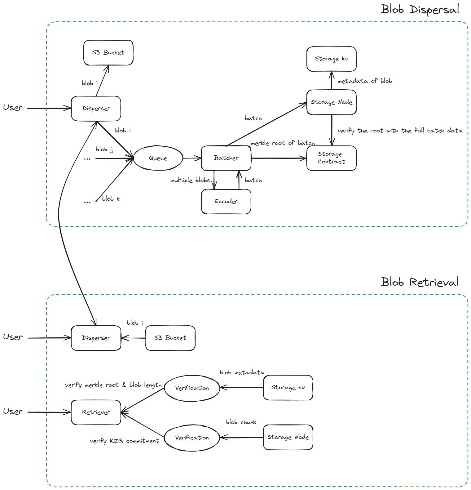

# Batcher

The batcher is an off-chain service which acts as a bridge between the Disperser and 0G Storage. It is in effect during the Dispersal phase. Figure 1 shows the detailed batcher workflow.

### Batch Process

1. When a user submits a dispersal request, the disperser service will store the blob and its metadata on to s3 and dynamodb correspondingly.&#x20;
2. The batcher has a encoder streaming process to listen to the update of the metadata on the dynamodb and triggers the [encoding process](../overview-1/encoding.md) of the blob data. The batcher stores the encoded blob data into its memory.
3. The batcher has a separate batching processor to query the memory and batch multiple encoded blobs into one batch. During this process, it also generates merkle proof for each blob based on its blob header.
4. The batcher then calls a dispatch service to dispatch the batch data and its metadata to 0G Storage for verification and data store.

### Dispatch Process

1. A dispatcher receives
   * Hash of the batch header
   * [Batch Header](../data-model.md#batch-header)
   * [Encoded Blobs](../data-model.md#encoded-blob)
   * [Merkle Proofs](../data-model.md#merkle-tree-proof)
2. Upon receiving the above data, the dispatcher will dump the batch data to 0G Storage node.
3. The dispatcher will also call an on-chain contract to upload batch headers.

Note that it is up to the 0G Storage Node to verify the correctness of the batch data with its header.

### Finalization

The batcher has two more components, confirmer and finalizer.

The confirmer is used to query the tx receipt from the on-chain contract to check if the transaction is confirmed on chain.

The finalizer is used to check the difference between the confirmed block number and current block number to determine if such transaction is finalized (no reorg) on chain.

<figure><figcaption>
Figure 1. Batcher Workflow
</figcaption></figure>
